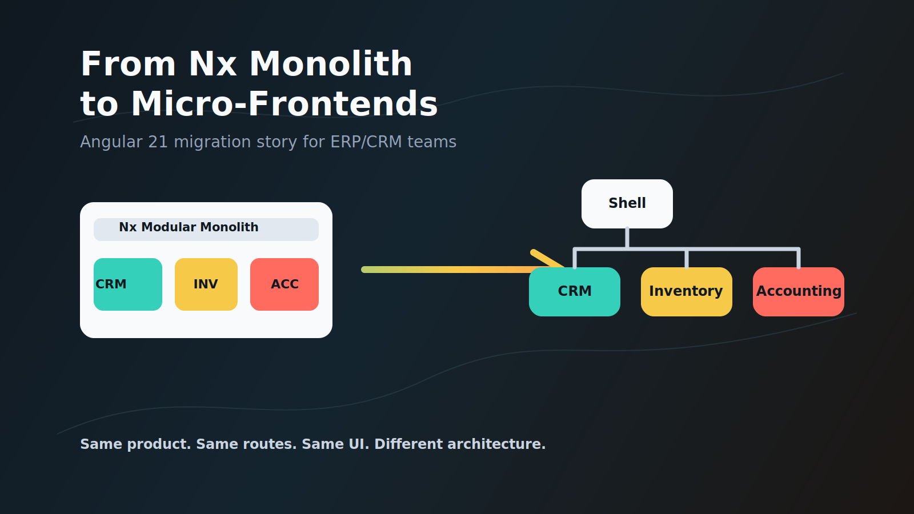
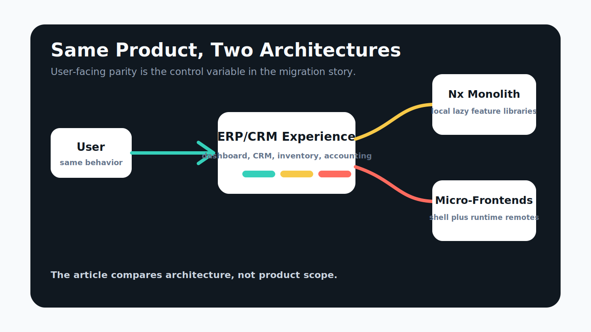
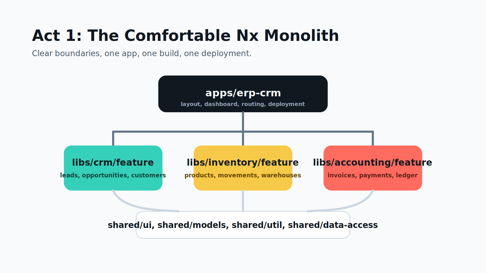
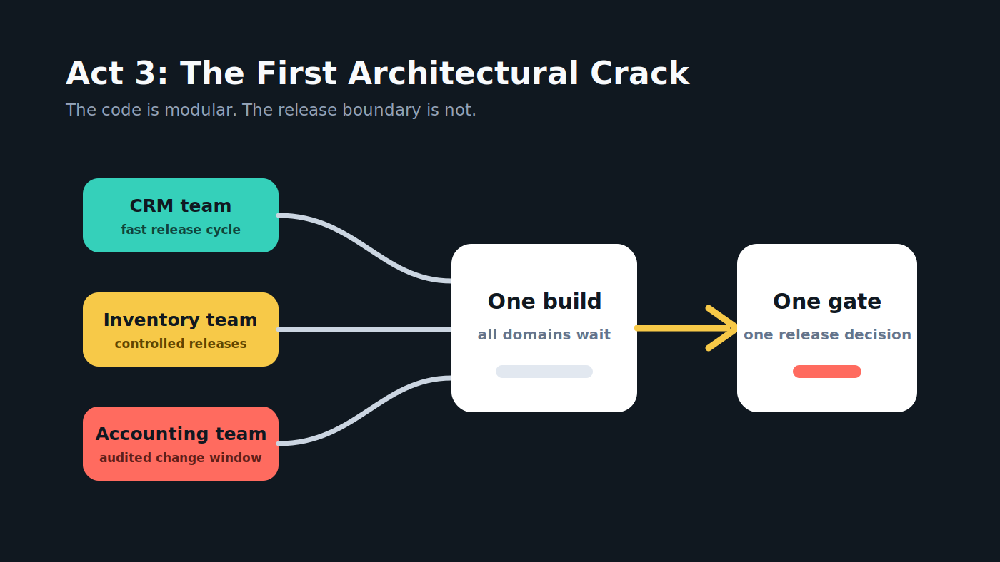
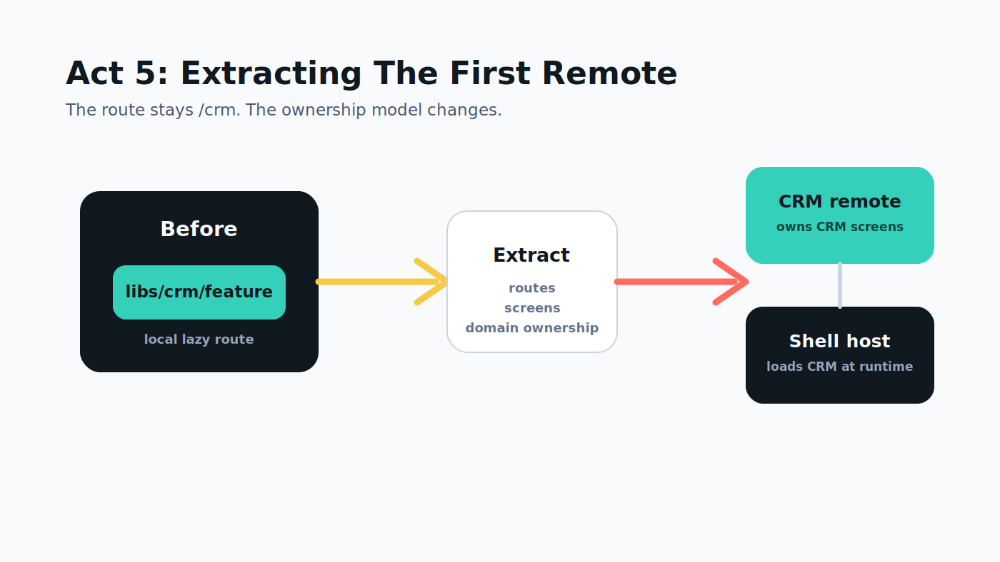
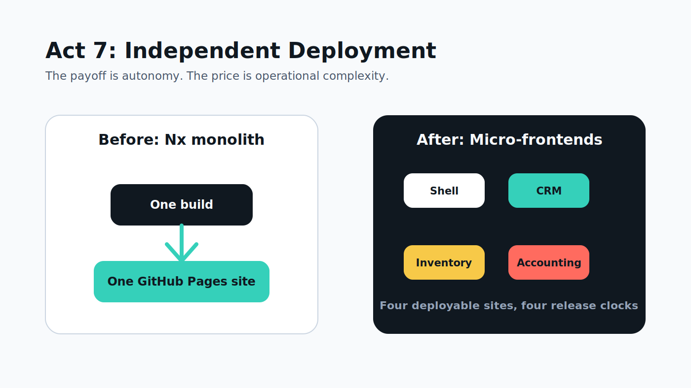
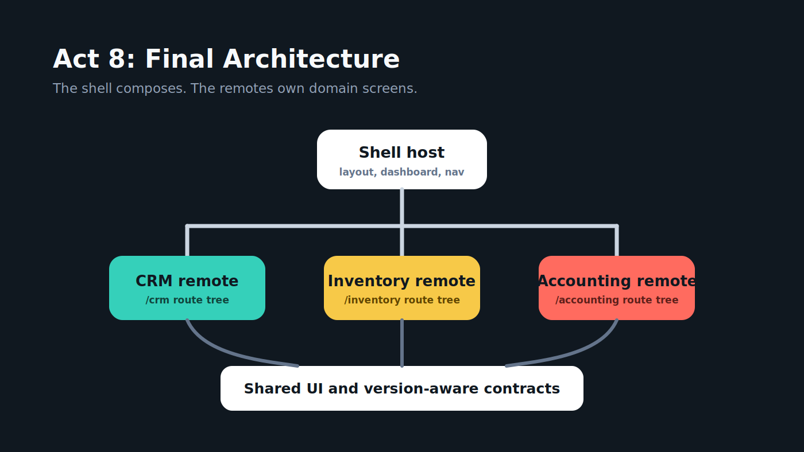

# From Nx Monolith to Micro-Frontends: A Real Migration Story

Subtitle: Building the same ERP/CRM product twice so the architecture tradeoff becomes visible.



## Draft Status

This is a Medium-ready first draft. It is intentionally dramatic, but still practical and step-by-step.

Recommended final title:

**From Nx Monolith to Micro-Frontends: A Real Migration Story**

## Opening

Most frontend architecture debates start too late.

By the time a team starts talking about micro-frontends, the app is usually already heavy, the release process is already tense, and every domain team already has a theory about who is slowing everyone else down.

So I wanted a cleaner experiment.

What if we built the same ERP/CRM application twice?

First as a calm, well-structured Angular 21 Nx modular monolith.

Then as Angular 21 micro-frontends with a shell, separately deployed remotes, and runtime composition.

Same screens. Same routes. Same mock data. Same user experience.

Only the architecture changes.

That contrast is the point of this article.

## Repositories

Before architecture:

- Nx monolith: https://github.com/amitmahida92/angular21-erp-crm-nx-monolith
- Live monolith: https://amitmahida92.github.io/angular21-erp-crm-nx-monolith/

After architecture:

- Shell host: https://github.com/amitmahida92/angular21-erp-crm-shell
- CRM remote: https://github.com/amitmahida92/angular21-erp-crm-crm-app
- Inventory remote: https://github.com/amitmahida92/angular21-erp-crm-inventory-app
- Accounting remote: https://github.com/amitmahida92/angular21-erp-crm-accounting-app
- Live shell: https://amitmahida92.github.io/angular21-erp-crm-shell/

## The Product Surface

The demo is intentionally small, but it behaves like the kind of frontend that grows inside companies:

- A shell layout with sidebar, topbar, dashboard, and auth placeholder.
- CRM screens for leads, opportunities, customers, and pipeline.
- Inventory screens for products, stock movements, warehouses, and reorder signals.
- Accounting screens for invoices, payments, and ledger placeholders.
- Shared cards, badges, buttons, data tables, models, utilities, and mock data.

Sales is represented through CRM opportunities and pipeline.

HR is not included because the reference MFE version does not include HR.

That constraint matters. If the article compares two architectures, the product surface must not quietly change underneath the reader.

## Graphic 1: Same Product, Two Architectures



Use this as the first architecture visual. It tells the reader the rule of the experiment immediately: the ERP/CRM product stays the same, while the architecture changes underneath it.

## Act 1: The Comfortable Nx Monolith

The monolith starts beautifully.

One repo. One Angular app. One build. One deployment.

Inside the repo, the code is not a mess. This is not the old "giant app with every file in one folder" story.

The Nx workspace gives us clear boundaries:

```text
apps/erp-crm
libs/crm/feature
libs/inventory/feature
libs/accounting/feature
libs/shared/ui
libs/shared/models
libs/shared/util
libs/shared/data-access
```

The app owns layout, dashboard, top-level routing, and deployment.

Each feature library owns its domain screens.

Shared libraries own reusable UI, contracts, utilities, and mock data.

This is a good architecture. That is important.

Micro-frontends are not the prize for escaping a bad monolith. They are usually the next move after a good monolith begins to meet organizational pressure.

### Code snippet: monolith routes

```ts
export const routes: Routes = [
  { path: '', pathMatch: 'full', component: DashboardComponent },
  {
    path: 'crm',
    loadChildren: () => import('@erp-crm/crm/feature').then((m) => m.CRM_ROUTES),
  },
  {
    path: 'inventory',
    loadChildren: () => import('@erp-crm/inventory/feature').then((m) => m.INVENTORY_ROUTES),
  },
  {
    path: 'accounting',
    loadChildren: () => import('@erp-crm/accounting/feature').then((m) => m.ACCOUNTING_ROUTES),
  },
  { path: 'auth', component: AuthPlaceholderComponent },
  { path: '**', redirectTo: '' },
];
```

## Graphic 2: The Comfortable Monolith



## Act 2: The ERP Starts Growing

At first, the release train feels simple.

CRM adds a pipeline board.

Inventory adds reorder signals.

Accounting adds payment records.

Everyone uses the same shared UI, the same table component, the same badge tones, and the same mock contracts.

Then the product starts behaving like a real ERP.

CRM wants to release every few days because sales teams need pipeline changes.

Inventory wants slower, safer releases because stock movement bugs are expensive.

Accounting wants stricter review, predictable change windows, and extra audit confidence.

The code boundaries are still clean.

The deployment boundary is not.

Everything still ships together.

## Act 3: The First Architectural Crack

The first crack is not technical.

It is organizational.

One team is ready. Another team is testing. A third team is waiting for finance approval. The build is green, but the release is politically red.

That is when the monolith starts to feel heavier than its code.

The app is still modular, but the teams cannot move independently.

This is the moment where micro-frontends begin to make sense.

Not because they are fashionable.

Because the deployment model no longer matches the team model.

## Graphic 3: Release Pressure



## Act 4: Drawing Domain Boundaries

Before extracting anything, we need to know what belongs together.

In the monolith, the future remote boundaries are already visible:

| Monolith library | Future remote |
|---|---|
| `libs/crm/feature` | CRM remote app |
| `libs/inventory/feature` | Inventory remote app |
| `libs/accounting/feature` | Accounting remote app |
| `libs/shared/ui` | Shared UI package/library |
| `libs/shared/models` | Shared contracts |
| `libs/shared/util` | Shared utilities |
| `libs/shared/data-access` | Shared mock data for demo purposes |

The most important rule is simple:

Domain libraries should not import each other.

CRM should not reach into Inventory.

Inventory should not reach into Accounting.

Accounting should not reach into CRM.

If that rule is ignored in the monolith, extraction becomes archaeology.

## Act 5: Extracting The First Remote

CRM is the best first extraction candidate.

It has a clear user surface:

- Leads
- Opportunities
- Customers
- Pipeline

It has its own route tree.

It uses shared contracts and shared UI without needing to own the shell.

In the monolith, the shell loads CRM like this:

```text
App route -> local lazy-loaded CRM feature library
```

After extraction, the shell loads CRM like this:

```text
Shell route -> remote entry -> CRM remote route definitions
```

The user still visits `/crm`.

The architecture underneath changes completely.

## Graphic 4: CRM Extraction



## Act 6: Wiring Angular 21 Module Federation

The shell stops importing local feature libraries.

Instead, it reads remote definitions and loads route definitions at runtime.

Conceptually, the shell route changes from this:

```ts
loadChildren: () => import('@erp-crm/crm/feature').then((m) => m.CRM_ROUTES)
```

To this:

```ts
loadChildren: () => loadRemoteRoutes(crmRemote)
```

The remote exposes its route definitions:

```ts
export const REMOTE_ROUTES: Routes = [
  {
    path: '',
    component: CrmWorkspaceComponent,
    children: [
      { path: '', pathMatch: 'full', component: LeadsComponent },
      { path: 'opportunities', component: OpportunitiesComponent },
      { path: 'customers', component: CustomersComponent },
      { path: 'pipeline', component: PipelineComponent },
    ],
  },
];
```

This is the architectural hinge of the migration.

The shell still owns the frame.

The remote now owns the domain screen.

## Act 7: Independent Deployment

In the monolith, deployment is calm:

```bash
npx nx build erp-crm --configuration=github-pages
```

One app builds.

One GitHub Pages artifact deploys.

In the micro-frontend architecture, deployment becomes more powerful and more demanding:

- The shell has its own deployment.
- CRM has its own deployment.
- Inventory has its own deployment.
- Accounting has its own deployment.
- The shell must know where the remotes live.
- The UI must handle unavailable remotes gracefully.

That is the trade.

You buy team autonomy with operational complexity.

## Graphic 5: Deployment Before And After



## Act 8: Final Architecture

The final architecture is not "better" in every way.

It is better for a specific pressure:

independent ownership and independent deployment of domain frontends.

The shell becomes a composition layer.

CRM, Inventory, and Accounting become independently deployable applications.

Shared libraries become contracts that need more discipline, not less.

## Graphic 6: Final MFE Architecture



## Act 9: Lessons Learned

Start with the monolith.

Make it modular.

Make the domain boundaries boringly obvious.

Do not extract too early.

Do not wait until every team is blocked either.

Micro-frontends are not a reward for complexity. They are a tool for distributing ownership when a single deployment boundary becomes the bottleneck.

The best part of this demo is that the user experience stays the same.

That gives us a fair comparison.

The monolith teaches structure.

The micro-frontend version teaches autonomy.

The migration teaches the tradeoff.

## Screenshot Checklist

Capture these after final QA:

| Screenshot | Purpose |
|---|---|
| Monolith dashboard | Show the before architecture |
| MFE dashboard | Show the after architecture |
| CRM leads in both apps | Prove user-facing route parity |
| Inventory products in both apps | Prove domain parity |
| Accounting invoices in both apps | Prove finance parity |
| Nx project graph | Show monolith boundaries |
| GitHub Pages deployment | Show monolith deployment simplicity |
| Browser network tab for MFE | Show remote loading |

## Publishing Notes

- Upload the SVG assets from `docs/article-assets/` into Medium, or export them to PNG first if Medium's SVG handling is inconsistent.
- Keep code snippets short.
- Link the repos near the top and again near the end.
- Mention that Sales is represented through CRM and HR is intentionally absent for parity.
- Call out the honest tradeoff: micro-frontends add runtime, routing, build, and deployment complexity.

## Compact Checkpoint

Medium article draft created and graphic assets added. The article now has a dramatic act structure, repo links, code snippets, exported SVG diagram assets, screenshot guidance, and the core migration argument.
